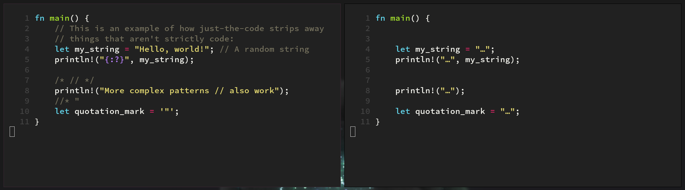

# Just the code

A [ripgrep](https://github.com/BurntSushi/ripgrep) preprocessor, that strips away comments and strings from your code,
allowing you to search for *just the code*, sometimes greatly reducing noise in your search results:


*Left: original file. Right: output of `just-the-code`.*

Its main advantages over other methods are:

- It is efficient, since it does not need to build a syntax tree or compile your code
- It runs in your terminal and can thus be integrated with other CLI tools
- It can easily be customized to fit your needs: you only need to specify how comments and strings look like for it to work with your language of choice
- Accurately handles nested comments, strings and interactions between different kinds of comments
- Integrates natively with `ripgrep`, so using it is as simple as passing one additional parameter

## Installation and usage

*Note: the installation instructions will change once I find the time to publish this app to crates.io*

```sh
# Grab the code
git clone https://github.com/adri326/just-the-code/

# Navigate to the correct repository
cd just-the-code/

# Build the code
cargo build --release

# Install it in your local PATH
cargo install --path .
```

To then use it, simply add `--pre just-the-code` to your ripgrep commands. For instance:

```sh
# Noisy, since a lot of "hello"s are present in strings in the code:
rg "hello"

# No more noise :)
rg --pre just-the-code "hello"
```

*Note: I plan on adding a few options that can be passed to `just-the-code`, so that it can be used outside of ripgrep as well.*

## Configuring

To configure `just-the-code`, you will need to create the file `~/.config/just-the-code/config.toml`.
There are a few global options available in it, but most will be language-specific:

```toml
# Whether or not to keep strings in the output
keep_strings = false

[lang.rust]
# Single-line comment tokens
line_comments = ["//"]

# Multi-line comment tokens, grouped as pairs
multiline_comments = [["/*", "*/"]]

# String delimiters
strings = ["\"", "'"]

# Tokens to ignore
blacklist = ["\\\"", "\\\\"]

# Whether or not to allow nested comments
nested_comments = false
```

The main logic of `just-the-code` has been made generic enough that you only need to tell it how strings and comments
look like for it to work with your language of choice. To do so, you will need to specify the following:

- Single-line comment tokens (`line_comments`): for instance `//` or `#`; anything after them will be considered part of a comment,
and multiline comments cannot be opened after them.
- Multi-line comment delimiters (`multiline_comments`): for instance `/*` and `*/`;
single-line comments between them will be ignored. They are grouped as opening/closing pairs.
- String delimiters (`strings`): commenting tokens in strings will be ignored, and string delimiters will be ignored in comments.
- Blacklist tokens (`blacklist`): any of the tokens specified will **not** be matched if it overlaps with a blacklisted token.
This lets you blacklist `\"` in strings, for instance.
- Whether or not to allow nested comments (`nested_comments`): if enabled, then `a /* /* */ */ b` will become `a  b`.
If disabled (which is the default), that same piece of code will instead become `a  */ b`.

### Note on `\"`

If your languages uses `"` for strings, then simply adding `\"` to the blacklist is not going to be enough:
`"\\"` will parse incorrectly, since `\"` will be seen as an escaped quotation mark.

To fix that, blacklist tokens are implemented to be mutually exclusive: two blacklist tokens cannot overlap when matched on a string.
This means that if you also add `\\` to the blacklist, then `"\\"` will parse correctly:
`\\` will be seen as one blacklist token, and `\"` won't be interpreted as an escaped quotation mark.

## Known issues

The performance of `ripgrep` also severaly drops when adding `--pre`, since ripgrep essentially needs to `fork()` once for each file searched.
It might be possible in the future to integrate `just-the-code` directly within `ripgrep`, so that everything can be done within the same process.
